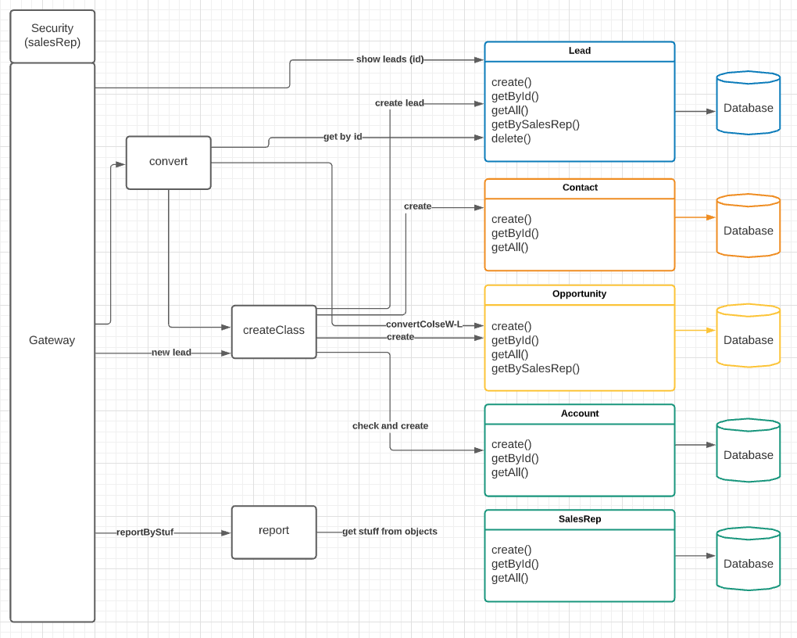

Existing Project Structure: 

<a href="https://github.com/EN-IH-WDPT-JUN21/Stolen-Name-LBL-Trucking_Company_Homework-3"> Stolen-Name-LBL-Trucking_Company_Homework-3 </a>

New Project Structure: 

SETUP - Cloud Method

Code for application properties

SETUP - Local Method

Services: 

- Gateway - https://github.com/NatNorb/gateway

- Account Service - https://github.com/MaddyKilmurray/CSharks-AccountMicroservice
- SalesRep Service - https://github.com/MaddyKilmurray/CSharks-SalesRepMicroservice
- Opportunity Service - https://github.com/NatNorb/opportunity-service
- Contact Service - https://github.com/jegor-chomczuk/contact-service
- Lead Service - https://github.com/Joaodss/h4-lead-service

- Convert Service - https://github.com/Joaodss/h4-convert-service
- Reporting Service - https://github.com/MaddyKilmurray/CSharks-ReportingService
