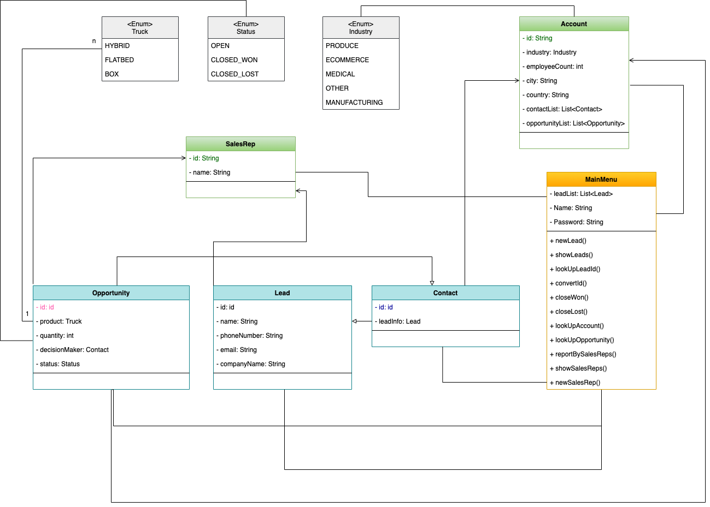
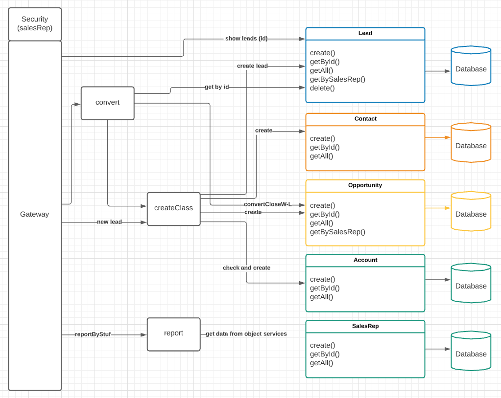

<h1>Project Specification</h1>

<h3>Requirements </h3>

As a team, decide the best microservice architecture. Consider where edge services might be advantageous and necessary individual services. Make sure that you are designing together how the application will be broken into services before starting.

Then, rebuild the exact project from the ground up utilizing microservices architecture and creating API routes for every current CLI command.

Remember to make the application as robust as possible.

<h3>Existing Project Structure: </h3>

<a href="https://github.com/EN-IH-WDPT-JUN21/Stolen-Name-LBL-Trucking_Company_Homework-3"> Stolen-Name-LBL-Trucking_Company_Homework-3 </a>

<h3>New Project Structure: </h3>

<h3>SETUP - Cloud Method</h3>

* Use this gateway as normal: https://cshark-h4.herokuapp.com

| Route Type | Route | Input Required | Service Called |
| - | - | - | - |
| POST | "/create/contact" | ContactDTO | CREATE-SERVICE |
| POST | "/create/opportunity" | OpportunityDTO | CREATE-SERVICE |
| POST | "/create/lead" | LeadDTO | CREATE-SERVICE |
| POST | "/create/account" | AccountDTO | CREATE-SERVICE |
| POST | "/create/salesrep" | SalesRepDTO | CREATE-SERVICE |
| POST | "/create/contact-opportunity" | ContactAndOpportunityDTO | CREATE-SERVICE |
| POST | "/create/contact-opportunity-account" | ContactAndOpportunityAndAccountDTO | CREATE-SERVICE |
| POST | "/convert/lead{id}" | Long: leadId, LeadConvertDTO | CONVERT-SERVICE |
| PUT | "/convert/opportunity/{id}/{status}" | Long: opportunityId, String: status | CONVERT-SERVICE |
| GET | "/report/bySalesRep/{dataType}" | String: dataType | REPORT-SERVICE |
| GET | "/report/byProduct/{dataType}" | String: dataType | REPORT-SERVICE |
| GET | "/report/byCountry/{dataType}" | String: dataType | REPORT-SERVICE |
| GET | "/report/byCity/{dataType}" | String: dataType | REPORT-SERVICE |
| GET | "/report/byIndustry/{dataType}" | String: dataType | REPORT-SERVICE |
| GET | "/report/byEmployeeCount/{reportType}" | String: reportType | REPORT-SERVICE |
| GET | "/report/byEmployeeCount/{reportType}" | String: reportType | REPORT-SERVICE |
| GET | "/report/oppsByAccount/{dataType}" | String: dataType | REPORT-SERVICE |
| GET | "/leads" |  | LEAD-SERVICE |
| GET | "/leads/{id}" | long: id | LEAD-SERVICE |
| GET | "/accounts" |  | ACCOUNT-SERVICE |
| GET | "/accounts/{id}" | Long: id | ACCOUNT-SERVICE |
| GET | "/contacts" |  | CONTACT-SERVICE |
| GET | "/contacts/{id}" | Long: id | CONTACT-SERVICE |
| GET | "/opps/all" |  | OPPORTUNITY-SERVICE |
| GET | "/opps/{id}" | Long: id | OPPORTUNITY-SERVICE |
| GET | "/salesrep" |  | SALESREP-SERVICE |
| GET | "/salesrep/{id}" | Long: id | SALESREP-SERVICE |

<h3>SETUP - Local Method</h3>

* Clone the repository
* Open each service, right-click on the pom.xml file and select "Add as Maven project"
* Select "Trust Project"
* Run each service

| Port | Route Type | Route | Input Required | Service Called |
| - | - | - | - | - |
| 8700 | POST | "/create/contact" | ContactDTO | CREATE-SERVICE |
| 8700 | POST | "/create/opportunity" | OpportunityDTO | CREATE-SERVICE |
| 8700 | POST | "/create/lead" | LeadDTO | CREATE-SERVICE |
| 8700 | POST | "/create/account" | AccountDTO | CREATE-SERVICE |
| 8700 | POST | "/create/salesrep" | SalesRepDTO | CREATE-SERVICE |
| 8700 | POST | "/create/contact-opportunity" | ContactAndOpportunityDTO | CREATE-SERVICE |
| 8700 | POST | "/create/contact-opportunity-account" | ContactAndOpportunityAndAccountDTO | CREATE-SERVICE |
| 8110 | POST | "/convert/lead{id}" | Long: leadId, LeadConvertDTO | CONVERT-SERVICE |
| 8110 | PUT | "/convert/opportunity/{id}/{status}" | Long: opportunityId, String: status | CONVERT-SERVICE |
| 8750 | GET | "/report/bySalesRep/{dataType}" | String: dataType | REPORT-SERVICE |
| 8750 | GET | "/report/byProduct/{dataType}" | String: dataType | REPORT-SERVICE |
| 8750 | GET | "/report/byCountry/{dataType}" | String: dataType | REPORT-SERVICE |
| 8750 | GET | "/report/byCity/{dataType}" | String: dataType | REPORT-SERVICE |
| 8750 | GET | "/report/byIndustry/{dataType}" | String: dataType | REPORT-SERVICE |
| 8750 | GET | "/report/byEmployeeCount/{reportType}" | String: reportType | REPORT-SERVICE |
| 8750 | GET | "/report/byEmployeeCount/{reportType}" | String: reportType | REPORT-SERVICE |
| 8750 | GET | "/report/oppsByAccount/{dataType}" | String: dataType | REPORT-SERVICE |
| 8100 | GET | "/leads" |  | LEAD-SERVICE |
| 8100 | GET | "/leads/{id}" | long: id | LEAD-SERVICE |
| 8600 | GET | "/accounts" |  | ACCOUNT-SERVICE |
| 8600 | GET | "/accounts/{id}" | Long: id | ACCOUNT-SERVICE |
| 8080 | GET | "/contacts" |  | CONTACT-SERVICE |
| 8080 | GET | "/contacts/{id}" | Long: id | CONTACT-SERVICE |
| 8200 | GET | "/opps/all" |  | OPPORTUNITY-SERVICE |
| 8200 | GET | "/opps/{id}" | Long: id | OPPORTUNITY-SERVICE |
| 8650 | GET | "/salesrep" |  | SALESREP-SERVICE |
| 8650 | GET | "/salesrep/{id}" | Long: id | SALESREP-SERVICE |

<h3>Services: </h3>

- Gateway - https://github.com/NatNorb/gateway
- Discovery - https://github.com/jegor-chomczuk/discovery-service

- Account Service - https://github.com/MaddyKilmurray/CSharks-AccountMicroservice
- SalesRep Service - https://github.com/MaddyKilmurray/CSharks-SalesRepMicroservice
- Opportunity Service - https://github.com/NatNorb/opportunity-service
- Contact Service - https://github.com/jegor-chomczuk/contact-service
- Lead Service - https://github.com/Joaodss/h4-lead-service

- Convert Service - https://github.com/Joaodss/h4-convert-service
- Reporting Service - https://github.com/MaddyKilmurray/CSharks-ReportingService

<h3>DTOs: </h3>

<code>AccountDTO {

    id: Long;
    
    industry: String;
    
    employeeCount: Integer;
    
    city: String;
    
    country: String;
} 

ContactAndOpportunityDTO {
    # Contact dataDTO
    name: String;
    
    phoneNumber: String;
    
    email: String;
    
    companyName: String;

    # OpportunityDTO data
    status: Status;
    
    product: Truck;
    
    quantity: Integer;
    
    decisionMaker: Long;

    # Common data
    salesRepId: Long;
    
    accountId: Long;
} 
</code>

`ContactAndOpportunityAndAccountDTO {
    # Contact data
    name: String;
    
    phoneNumber: String;
    
    email: String;
    
    companyName: String;

    # Opportunity data
    status: Status;
    
    product: Truck;
    
    quantity: Integer;
    
    decisionMaker: Long;

    # Common data
    salesRepId: Long;
    
    accountId: Long;
    
    # Account data
    id: Long;
    
    industry: String;
    
    employeeCount: Integer;
    
    city: String;
    
    country: String;
} 
`

`ContactDTO {
    name: String;
    
    phoneNumber: String;
    
    email: String;
    
    companyName: String;
    
    salesRepId: Long;
    
    accountId: Long;
    
    id: Long;
} 
`

`LeadDTO {
  id: Long;
  
  name: String;
  
  phoneNumber: String;
  
  email: String;
  
  companyName: String;
  
  salesRep: Long;
} 
`

`LeadConvertDTO {
  product: String;
  
  quantity: Integer;
  
  accountId: Long;
  
  industry: String;
  
  employeeCount: Integer;
  
  city: String;
  
  country: String;
} 
`

`NewLeadDTO {
  name: String;
  
  phoneNumber: String;
  
  email: String;
  
  companyName: String;
  
  salesRep: Long;
} 
`

`OpportunityDTO {
  status: Status;
  
  product: Truck;
  
  quantity: Integer;
  
  decisionMaker: Long;
  
  accountId: Long;
  
  salesRepId: Long;
} 
`

`SalesRepDTO {
  id: Long;
  
  repName: String;
} 
`
